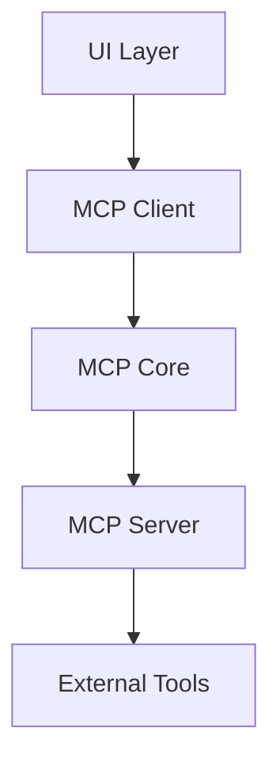
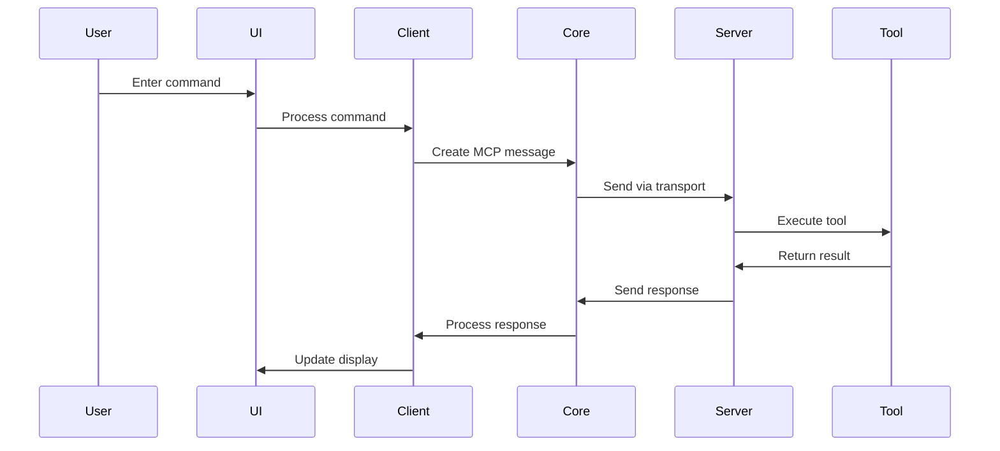
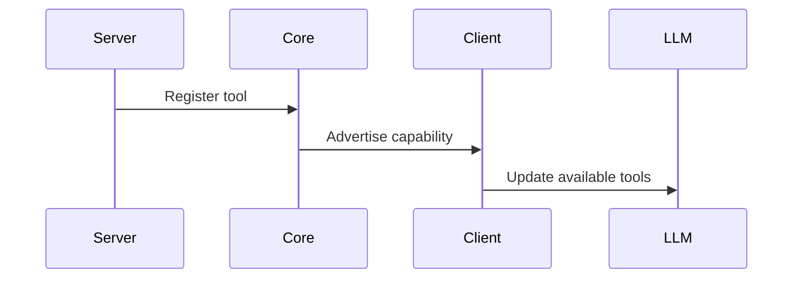

# SMCP Architecture

This document describes the high-level architecture of SandboxMCP (SMCP). If you want to contribute to the project, this should help you understand how the different pieces fit together.

## Bird's Eye View

SMCP is an open-source framework that enables local LLMs to communicate with external tools and services using the Model Context Protocol (MCP). The system consists of three main components:



## Core Components

### 1. MCP Core (`packages/mcp-core`)

The core package implements the fundamental MCP protocol and provides the foundation for both client and server implementations. It handles:

- Protocol message definitions and type system
- Transport layer abstraction (stdio, HTTP/SSE)
- Message serialization/deserialization
- Connection management
- Error handling

Key abstractions:

```typescript
interface MCPMessage {
  type: MessageType;
  payload: unknown;
  id: string;
}

interface MCPTransport {
  send(message: MCPMessage): Promise<void>;
  receive(): AsyncIterator<MCPMessage>;
}
```

### 2. MCP Client (`packages/mcp-client`)

The client package provides a high-level interface for applications to interact with MCP servers. It includes:

- UI components for Claude-like experience
- LLM integration layer
- Server connection management
- Tool registry and discovery
- Context management

Main concepts:

```typescript
interface LLMProvider {
  generateResponse(prompt: string, context: Context): Promise<string>;
  handleToolCall(tool: Tool, args: unknown[]): Promise<unknown>;
}

interface MCPClient {
  connect(server: MCPServerConfig): Promise<void>;
  registerTool(tool: Tool): void;
  execute(command: string): Promise<Result>;
}
```

### 3. MCP Server (`packages/mcp-server`)

The server package implements the server-side of the MCP protocol and provides a framework for building custom tool integrations:

- Base server implementation
- Tool definition framework
- Resource management
- Authentication and authorization
- Logging and monitoring

Core interfaces:

```typescript
interface MCPServer {
  start(): Promise<void>;
  stop(): Promise<void>;
  registerTool(tool: Tool): void;
}

interface Tool {
  name: string;
  description: string;
  parameters: ToolParameter[];
  execute(args: unknown[]): Promise<unknown>;
}
```

## Communication Flow

1. **User Input Flow**



2. **Tool Registration Flow**



## Security Model

SMCP implements a security-first approach:

1. **Transport Security**

   - Local-only by default
   - Optional encrypted transport for remote connections
   - Authentication for remote servers

2. **Tool Authorization**

   - Fine-grained permission system
   - Tool-level access control
   - Resource isolation

3. **Data Privacy**
   - Local execution environment
   - No data leaves the system by default
   - Configurable data access policies

## Extension Points

SMCP is designed to be extensible at multiple levels:

1. **LLM Integration**

   - Custom LLM providers
   - Model-specific optimizations
   - Different inference backends

2. **Tool Development**

   - Custom tool implementations
   - New tool categories
   - Resource adapters

3. **Transport Layer**
   - New transport protocols
   - Custom serialization formats
   - Network optimizations

## Development Workflow

The typical workflow for developing SMCP components:

1. **Core Protocol Changes**

   - Update message definitions
   - Add new primitives
   - Maintain backwards compatibility

2. **Client Features**

   - Implement UI components
   - Add client-side utilities
   - Enhance developer experience

3. **Server Implementation**
   - Create new tool types
   - Implement server features
   - Add integration tests

## Testing Strategy

SMCP employs a comprehensive testing approach:

1. **Unit Tests**

   - Protocol message handling
   - Tool execution
   - Client/server communication

2. **Integration Tests**

   - End-to-end workflows
   - Multi-tool scenarios
   - Error handling

3. **Performance Tests**
   - Message throughput
   - Resource usage
   - Scalability benchmarks

## Future Directions

Areas for future development:

1. **Enhanced Tool Ecosystem**

   - More built-in tools
   - Tool marketplace
   - Community contributions

2. **Advanced Features**

   - Tool chaining
   - Workflow automation
   - Context awareness

3. **Enterprise Features**
   - Clustering
   - High availability
   - Monitoring and metrics

## Contributing

See [CONTRIBUTING.md](./CONTRIBUTING.md) for detailed information about contributing to SMCP.
